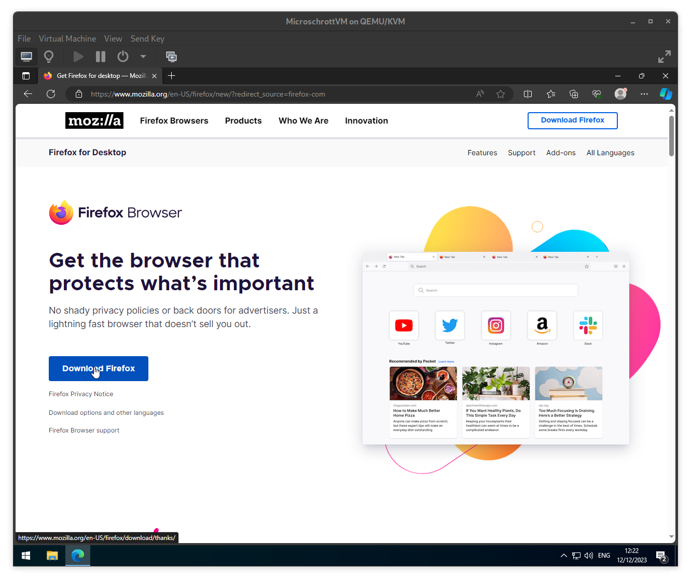
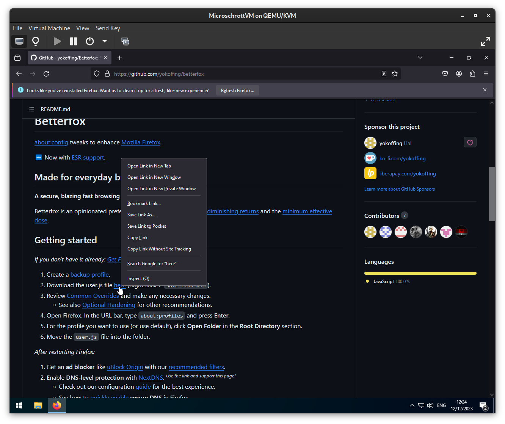
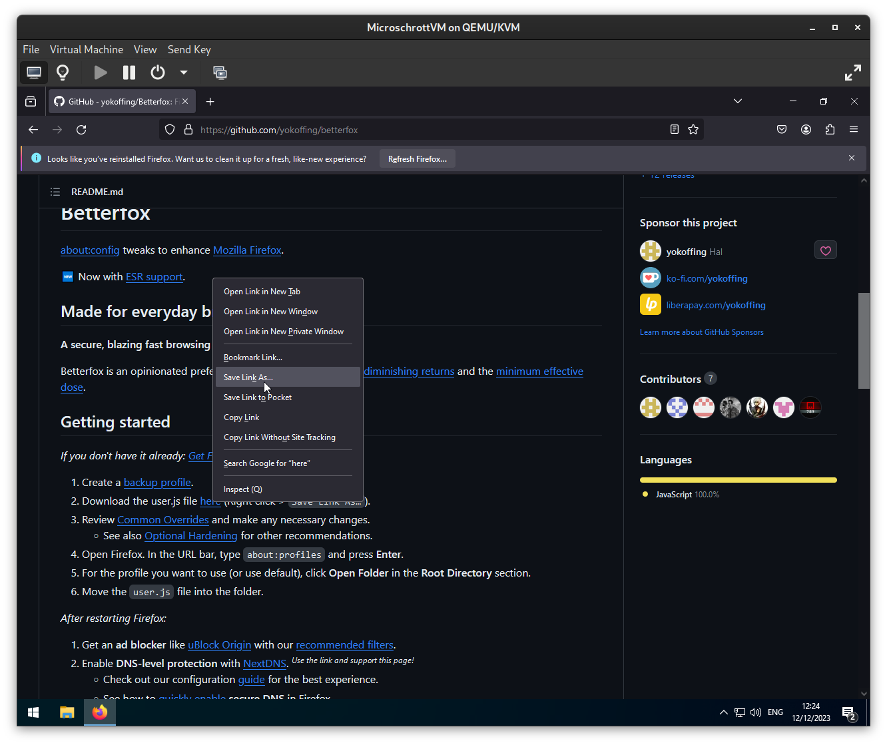
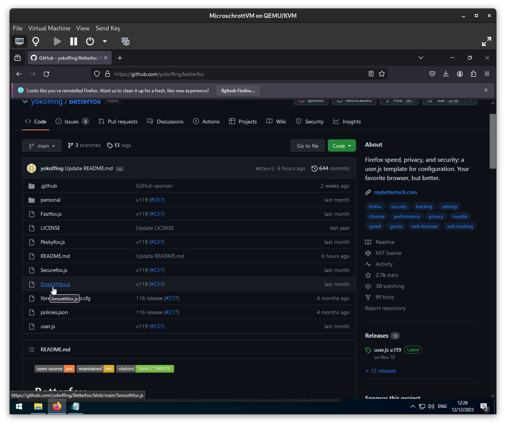
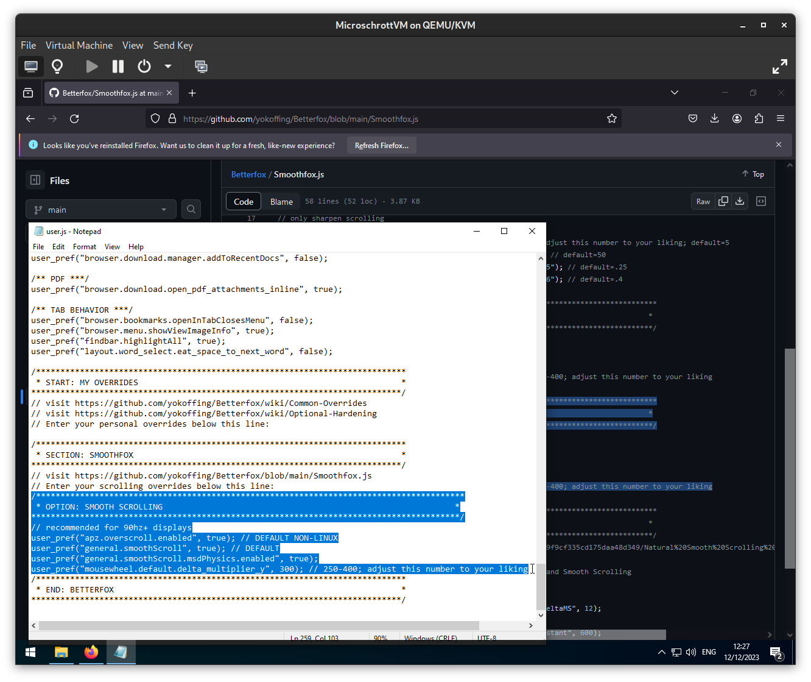
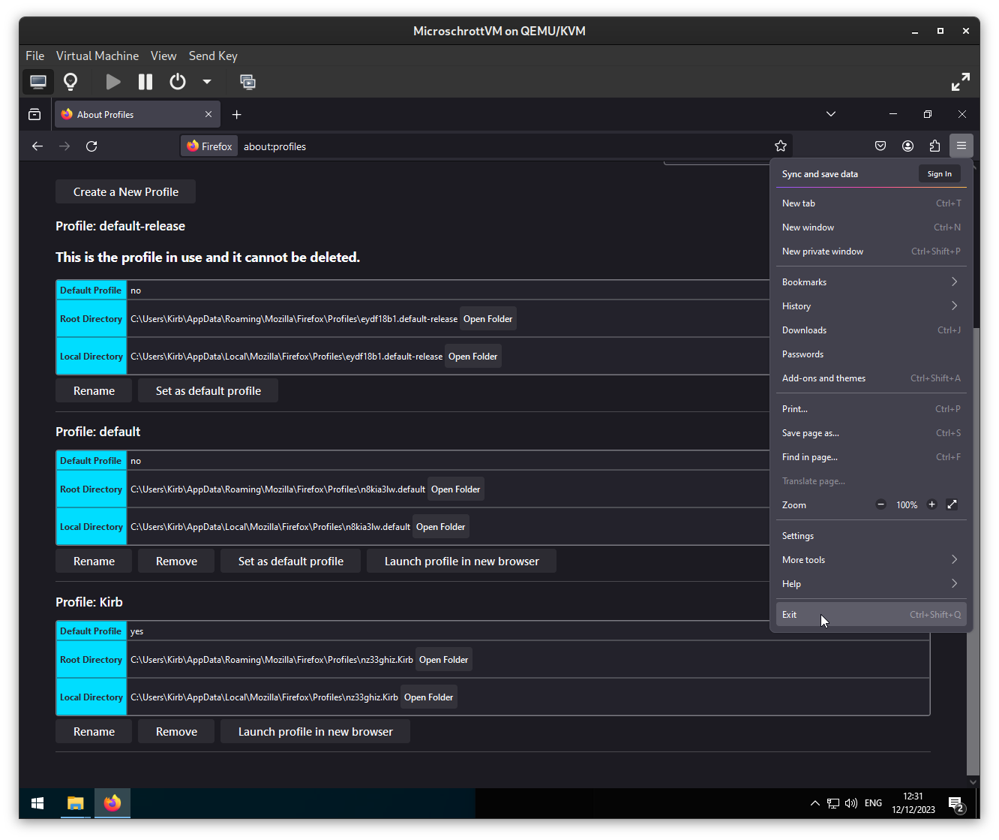
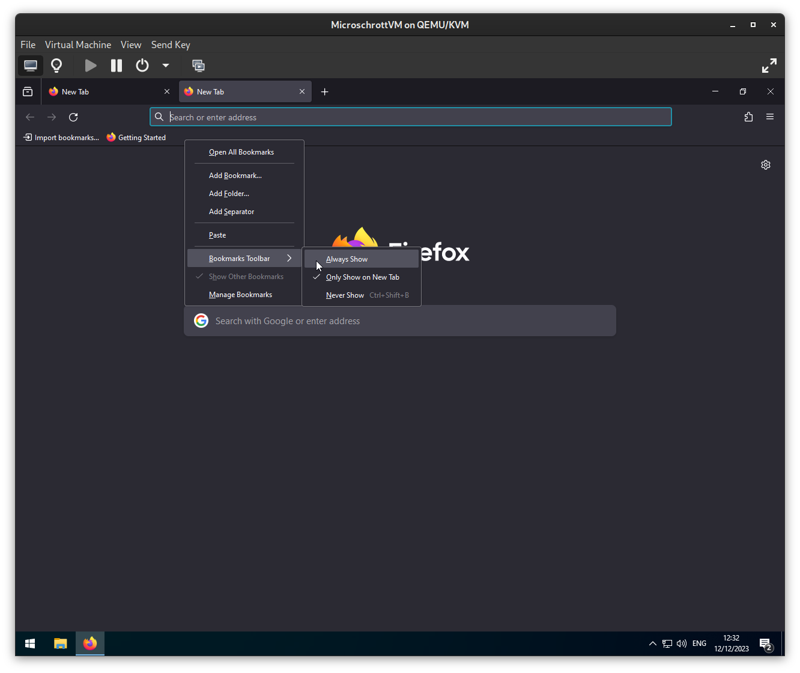
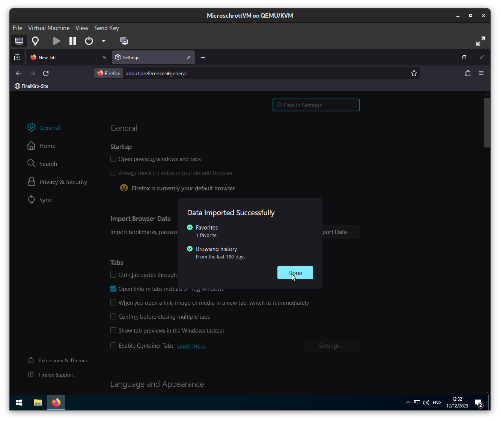
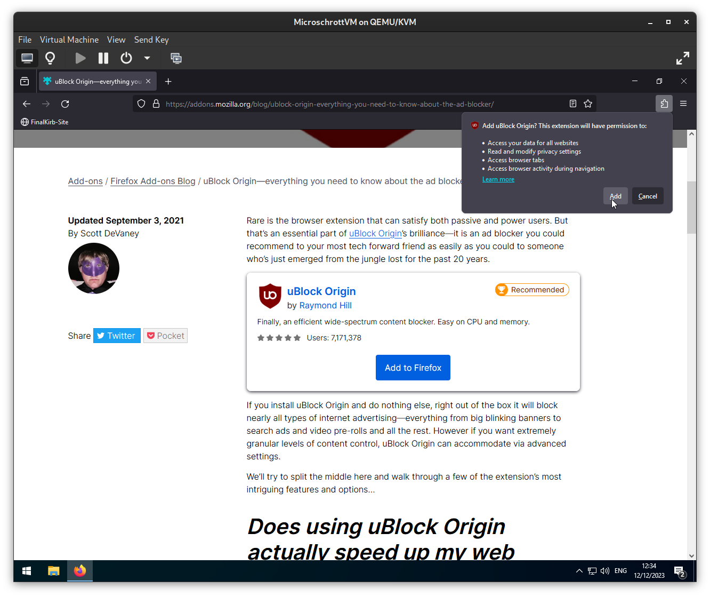

# Kirb's Simple Firefox Setup
Current state: 10th December 2023

A simple Firefox setup made to greatly improve the average person's protection against ads and trackers online, who's typically coming from Chrome/Edge/Opera.

## Phase 1: Installing Firefox
- Go to https://firefox.com and download the Firefox installer

- Run the 'Firefox Installer.exe' file and start the installation by pressing "Yes"

- Wait for the Firefox Installer to finish, after it's finished it will automatically open the browser

- If you wish, you can easily import your browsing history, bookmarks, passwords, etc. from your previous browser with the click of a button

- If you have Firefox Mobile, you can sync tabs together by scanning a QR Code. I don't need this, so I'll skip this step

- Skip the prompt and click on "Start Browsing"

- If you want to sync your browser bookmarks, browsing history, extensions, etc. across multiple firefox installations you can open the hamburger menu on the top right and sign in or register with a mozilla account.

## Phase 2: Setting up Firefox
- Alright, with Firefox installed we've gotta set it up for greatness
- When you open a new tab you're presented with the home page. Click on the gear icon on the top right and disable "Sponsored shortcuts".

- I prefer using the bookmark bar at the top, so I'll be disabling the home page shortcuts entirely. Configure your homepage how you like it, or disable it altogether later on.

- If you don't use Firefox View, right-click the button on the top left of the window and click on "Remove from Toolbar"

- If you don't use Firefox Pocket, right-click the icon and "Remove from Toolbar"

- If you don't need them anymore, you can safely delete the pre-existing bookmarks and add your own later on.

- Right-Click the Bookmarks Toolbar and choose the option that you prefer, in my case I prefer always having my bookmarks visible.
	- Under "Customize Toolbar..." you can reorganize the buttons on the toolbar, reordering, removing or adding buttons as you wish!

  
  

- Open the hamburger menu (3 lines) on the top right and open the "Settings"

- If it isn't set already, make Firefox the default browser

- Scroll down to "Files and Applications" and enable "Always ask you where to save files", this lets you organize your downloaded files much more easily and greatly reduces the risk of a site downloading something without your explicit permission.

- Scroll down further and select "Ask wether to open or save files"

- At the very bottom, open the Network Settings and enable "Proxy DNS when using SOCKS v5"

- Click on "OK"

- Disable the "Recommend extensions as you browse" and "Recommend features as you browse" checkboxes

- Go to "Search" options
- Remove every search engine you do not use, I recommend using Startpage instead of Google for a privacy-friendly alternative with the exact same search results. If you use a different search engine, the same steps to add a search engine apply

- Open "https://startpage.com"

- Right click the address bar and click on "Add Startpage Search"

- Change your default search engine to "Startpage", or whichever you prefer.

- Go to "Privacy & Security"
- Set the Tracking Protection to "Strict"

- I recommend using a password manager instead of saving your credentials in your browser directly, so I will be disabling this feature. Do what fits your workflow best, though

- Disable Telemetry

- Enable HTTPS-Only, when visiting HTTP sites you will be shown a warning that the traffic between you and the website is not encrypted

## Phase 3: Extensions
- Under "Extensions & Themes" at the bottom left, search for "uBlock Origin". This will open a web page to addons.mozilla.org

- Open uBlock Origin (Not the Lite version) and then click on "Add to Firefox"

- Click on "Add", before clicking away make sure to enable "Allow the extension to run in Private Windows"

Congratulations! You now have a fully functional Firefox install that blocks ads and web trackers by default, happy browsing!

