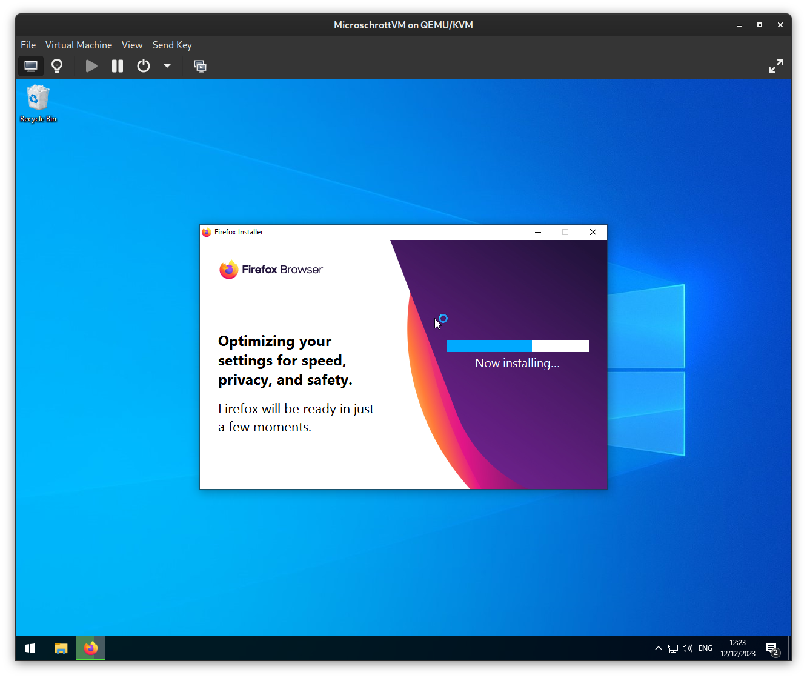
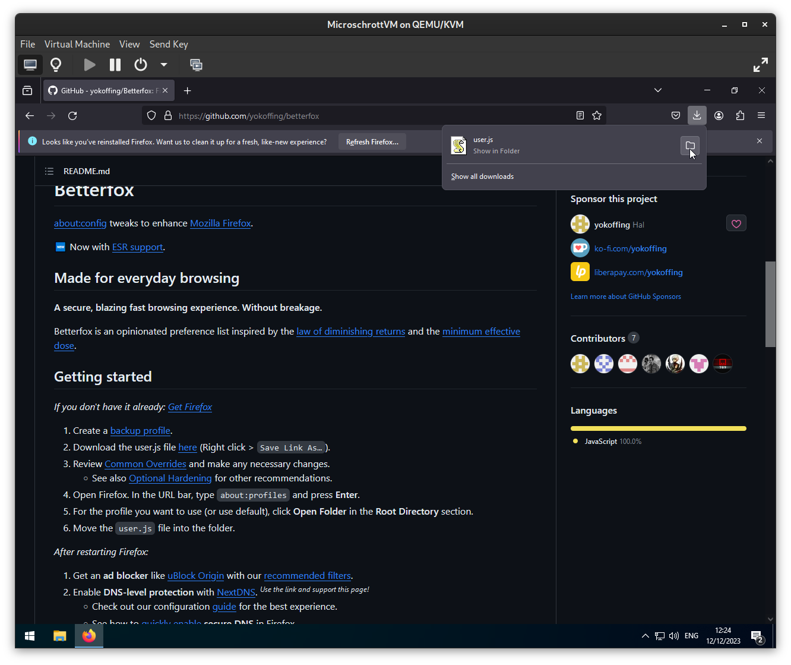
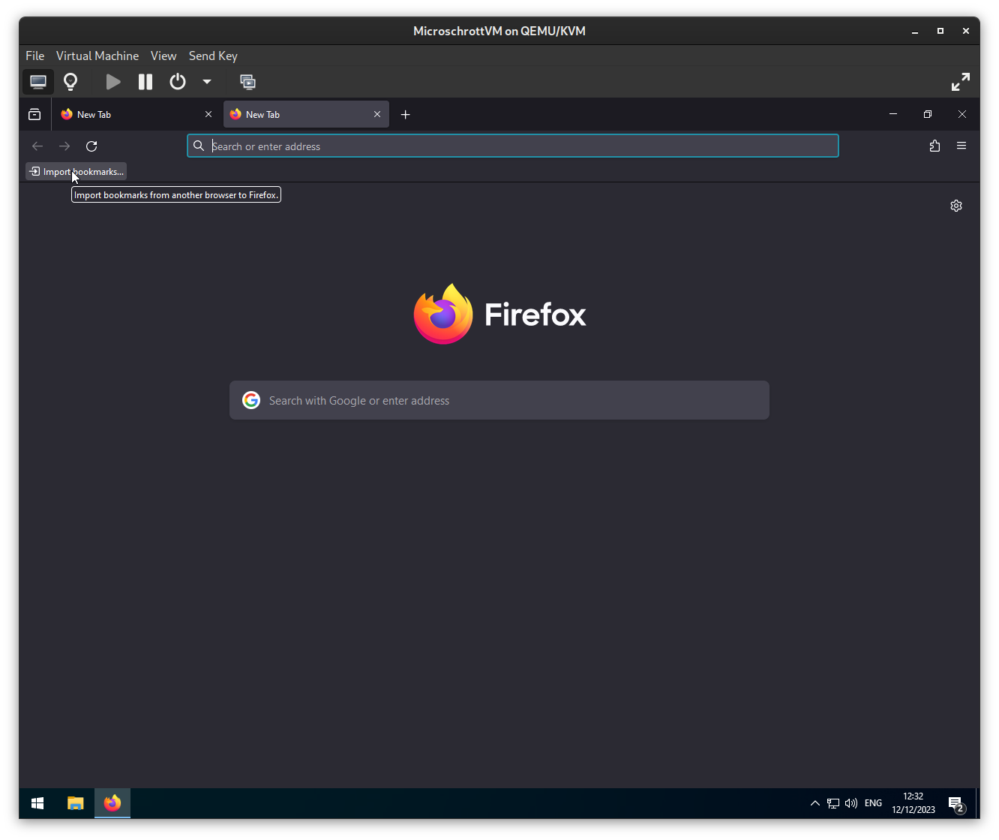
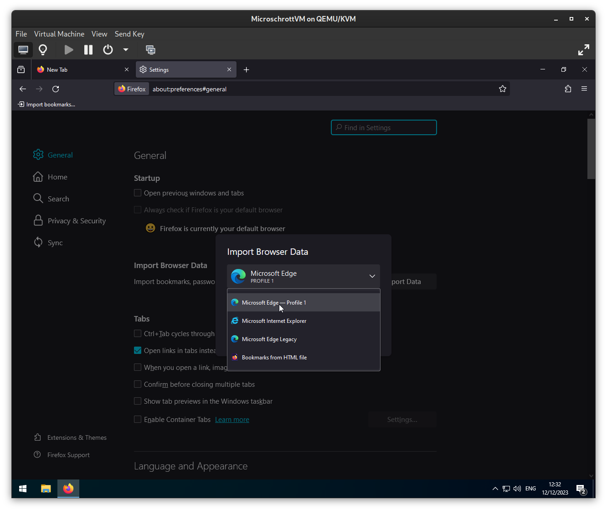
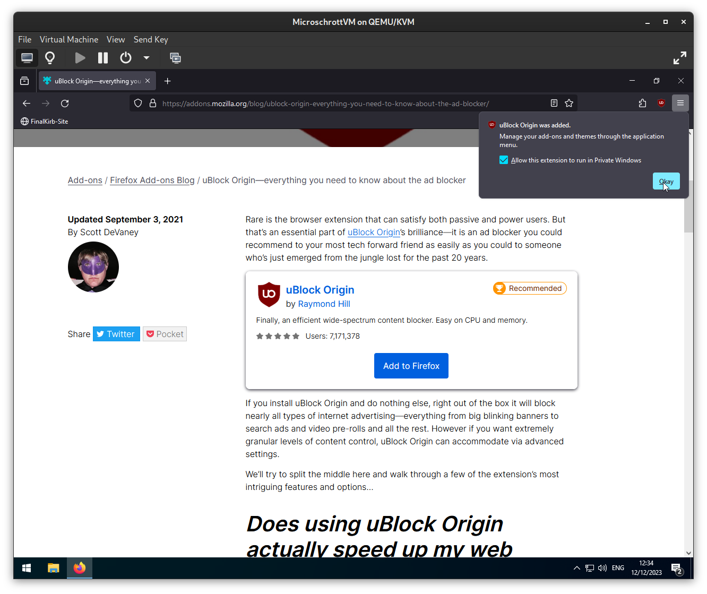
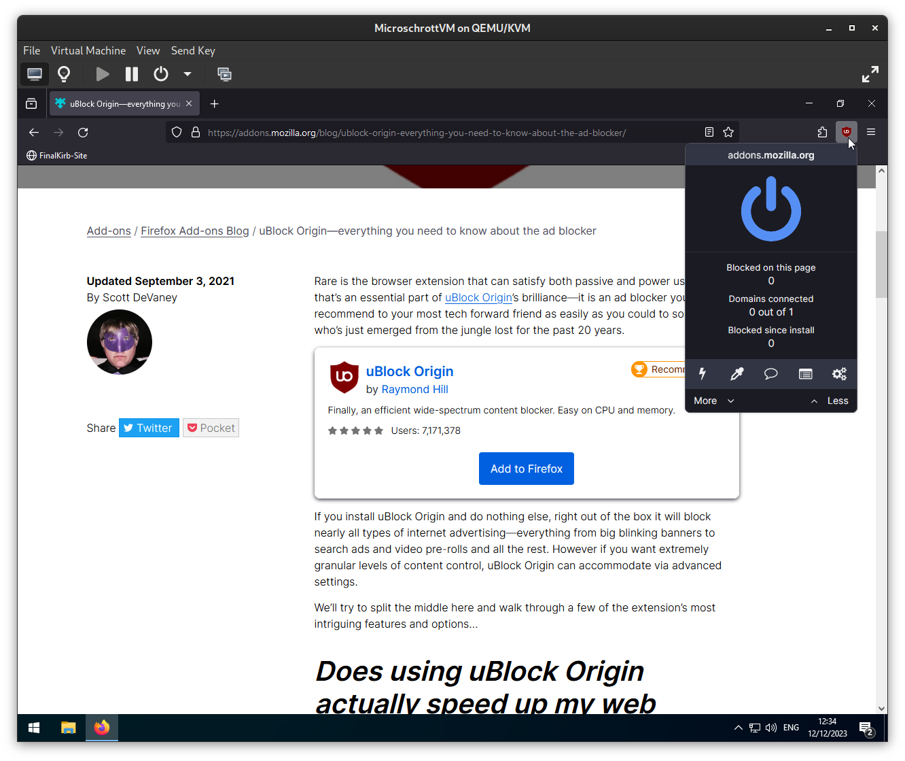
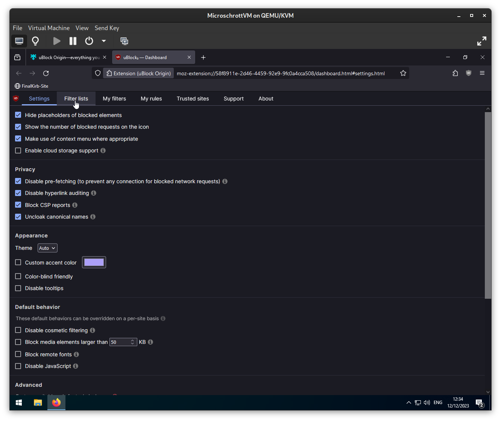
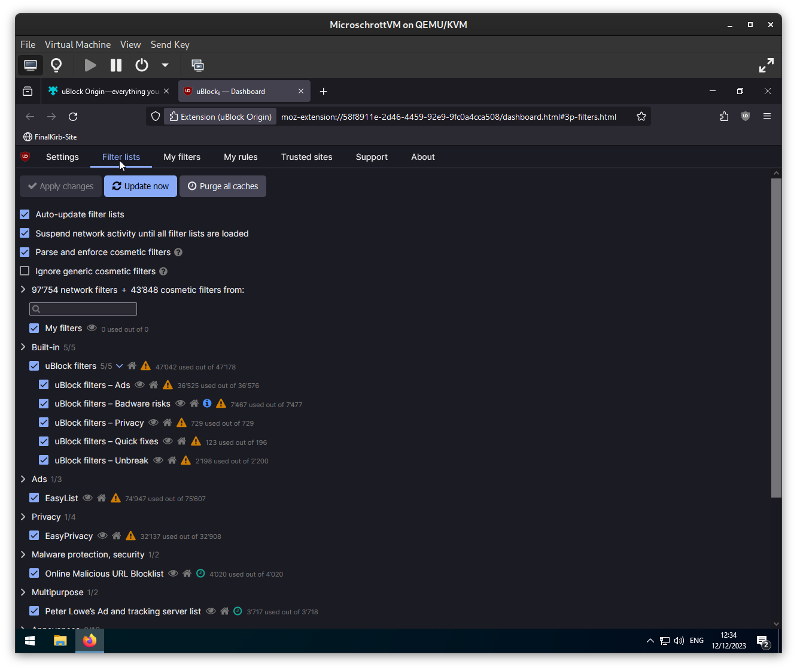

# Kirb's Optimal Firefox Setup

Sources
https://github.com/yokoffing/Betterfox
https://github.com/yokoffing/NextDNS-Config
https://github.com/yokoffing/filterlists

Warning: Following this setup will disable saving passwords and credit cards on the browser, to enable them, paste the override settings from the Betterfox documentation before copying over your "user.js" file
https://github.com/yokoffing/Betterfox/wiki/Common-Overrides

## Phase 1: Installing Firefox
- Download the Firefox Installer from Firefox.com

- Open the Firefox Installer executable and install firefox

## Phase 2: Setting up Firefox
- Open Firefox and head to https://github.com/yokoffing/Betterfox

- Scroll down to "Getting started" and right-click "here"

- Select "Save Link As..." and save the "user.js" file on your computer

- [OPTIONAL BUT RECOMMENDED, FOR SMOOTH SCROLLING]
	- Show in explorer, right-click the "user.js" file and click on "Edit"

	- 
	

	- 
	

	- When you get a security warning, click on "Open"

	- 
	

	- Open "Smoothfox.js" at the top of the betterfox page

	- 
	

	- Copy the option that fits best with your monitor's refresh rate
		- If you're unsure which one you should choose, use the "recommended for 60hz+ displays" option

		- 
		

	- Paste it under "SECTION: SMOOTHFOX", for this example I'll use the "recommended for 90hz+ displays" as I have a high refresh-rate monitor

	- 
	

	- 
	

	- Save the "user.js" file
- Enter "about:profiles" in the address bar

- Click on "Create a New Profile"

- Click on "Next"

- Name your Firefox Profile and click on "Finish"

- Under "Profile: Kirb" click on "Open Folder" right next to "Root Directory"

- This should open your new profile's folder, drag your "user.js" file in there

- Open the hamburger menu (3 lines) on the top right
- Click on "Exit"

- Reopen Firefox

- Open a new tab

- If you wish to have a visible toolbar for your bookmarks, right-click on the empty part of the toolbar and set "Bookmarks Toolbar" to "Always Show"

- Right-click on the "Getting Started" bookmark and delete it

- If you wish to import bookmarks, browsing history, etc. from your previous browser, click on "Import bookmarks"

- Select the browser profile you want to import from

- Click on "Import" and "Done"

## Phase 3: Configuring Firefox
- Open https://addons.mozilla.org/blog/ublock-origin-everything-you-need-to-know-about-the-ad-blocker
- Scroll down and click on "Add to Firefox" under "uBlock Origin"

- Click on "Add"

- Enable "Allow this extension to run in Private Windows" and click on Okay

- Click on the uBlock Origin Icon

- Open the dashboard with the gear icon

- Open the "Filter lists" tab

- Expand all of the categories and enable the following Filter lists:

	- Block Outsider Intrusion into LAN
	- Easylist - Annoyances
	- uBlock filters - Annoyances

	
	

- Open https://github.com/yokoffing/filterlists and press "Subscribe" to the following filterlists:
	- Hagezi's Personal Blocklist
	- Actually Legitimate URL Shortener Tool
	- yokoffing's Annoyance list

	
	

	
	

	
	

	
	

	
	

	
	

- Apply changes & Update now

- You can now close the uBlock Origin Dashboard!

- For a privacy-friendly drop-in replacement of Google Search, I heavily recommend using Startpage as your search engine. You get the exact same search results, but preserve your online privacy.
	- You can follow the following steps with whatever Search Engine you prefer, it doesn't have to be Startpage!
- Open a new tab and open https://startpage.com

- Right-click the address bar and select "Add Startpage Search"

- Go to the firefox settings and under "Search" options:

	- Change your default Search Engine to Startpage (Or whatever you prefer) and enable "Use this search engine in Private Windows"

	
	

	
	

	- Scroll down and remove every listed search engine you don't need, in my setup I'm removing:
		- Google
		- Amazon.com
		- Bing
		- Wikipedia(en)

		
		

		
		

- Open a new tab and search for something with Startpage
- Open the Settings via the gear icon

- Change the following settings and then click on "Save your settings"
	- Region filter: For local results, choose your region inside startpage

	
	

	- Disable "Promotional messaging"

	
	

- Save your Startpage Settings

- Under "General" options you can choose how you'd like firefox to behave, these are mostly a matter of personal preference. Enable what is most convenient for you
	- Enable "Open previous windows and tabs" if you want your tabs to stay after closing firefox
	- Enable "Confirm before closing multiple tabs" if you want there to be a confirmation window before closing the browser with multiple tabs
	- When you enable "Enable Container Tabs", you can hold down on the "new tab" button to select and open a so-called "Container Tab"
		- Container Tabs let you seperate your browsing activites through different color-coded containers. These containers are isolated from each other, meaning that the logins from your "School" container are completely seperated from the rest of your browser. This lets you stay logged in to your personal Google account while browsing at home. Need to access your school's gmail? Just open gmail in your dedicated "School" container and log in without any crossover, as if it was a new browser.

		
		

## Phase 4: NextDNS
- Open https://nextdns.io
- Click on "Try it now"

- Open the "Security" tab and change the following settings:
	- Enable "DNS Rebinding Protection"
	- Enable "Block Parked Domains"

	
	

	
	

	
	

- Open the "Privacy" tab and do the following:
	- Remove "NextDNS Ads & Trackers Blocklist"

	
	

	
	

	
	

	- Under "Blocklists", click on "Add a Blocklist"
		- Press CTRL+F on your keyboard and search for "Hagezi - Multi Normal"

		
		

		- Click on "Add"
			- Unless you know what you're doing, DON'T RANDOMLY ADD BLOCKLISTS. They may no longer be updated, may contain duplicate links or false positives.

			
			

	- Under "Native Tracking Protection", click on "Add"
		- Add all of the brands you use. There's no advantage in adding brands you don't have, but there's also no disadvantage in adding unused brands either

		
		

		
		

	- Enable "Allow Affiliate & Tracking links"
		- Leaving this disabled could cause some false positives when opening email links, your IP Address will be hidden

		
		

- Open the "Settings" tab
	- Disable "Enable Logs"
		- If you want to have Logs of your DNS Queries, make sure to set the Storage Location to Switzerland and configure the Retention time

		
		

	- Enable "Cache Boost"

	
	

	- [Optional] Enable Web3

	
	

- Go back to the "Setup" tab

	
	

- Copy the link next to "DNS-over-HTTPS" (https://dns.nextdns.io/------)

	
	

- Open your Firefox Settings

	
	

- Go to "Privacy & Security"
- Scroll all the way down to "DNS over HTTPS"
- Click on either "Increased Protection" or "Max Protection"

	
	

- Select "Custom", paste your NextDNS link and press Enter, under your Provider you should now see dns.nextdns.io

	
	

Congratulations! You now have an optimal firefox setup that doesn't spy on you, performs like a charm and protects your privacy by blocking online ads and trackers.
