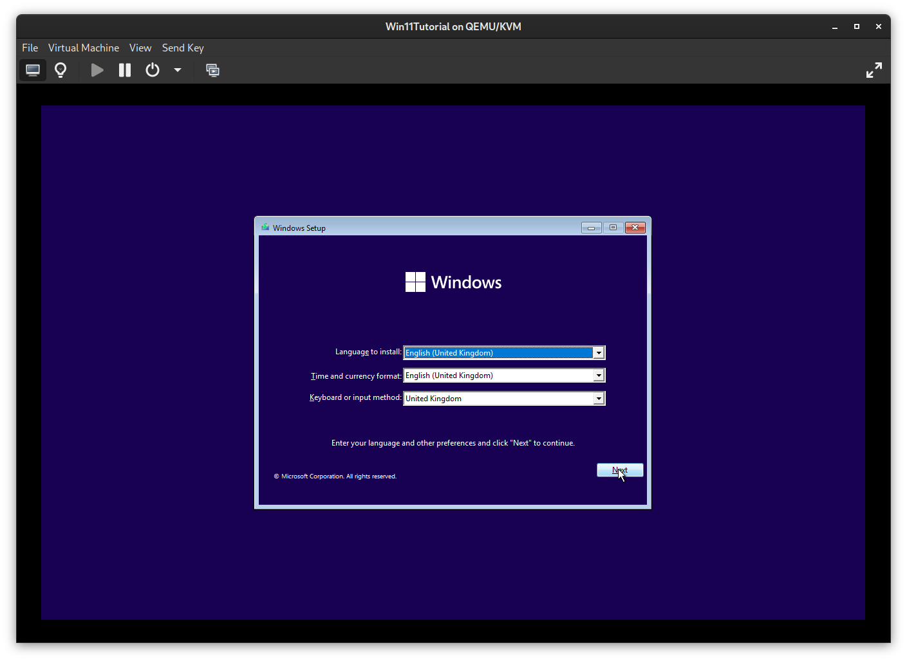
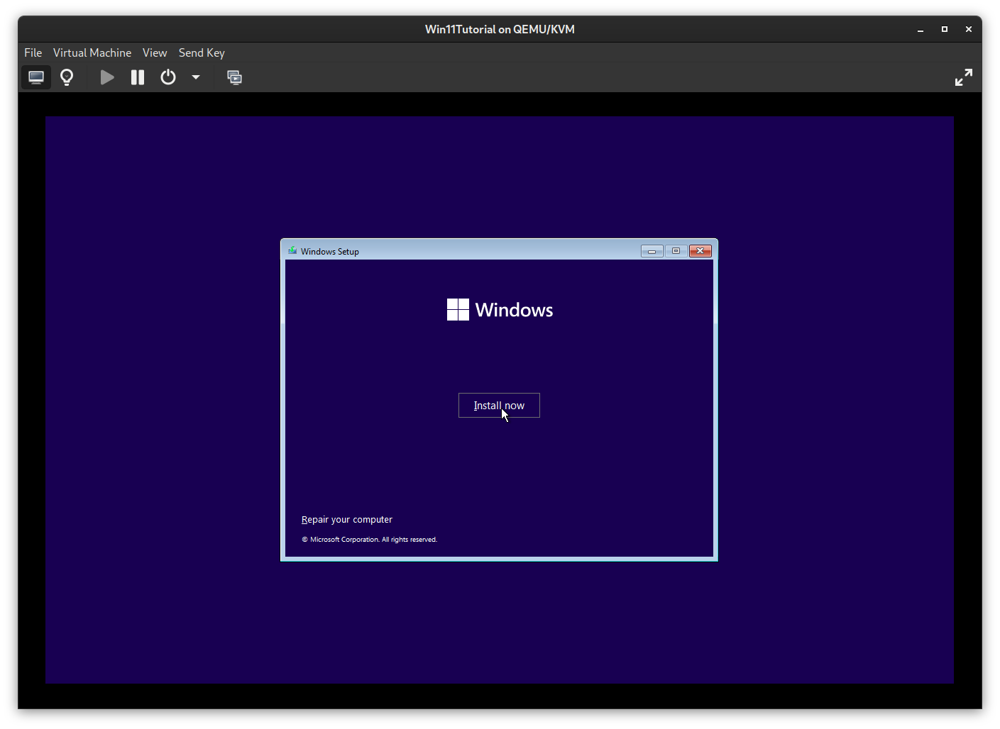
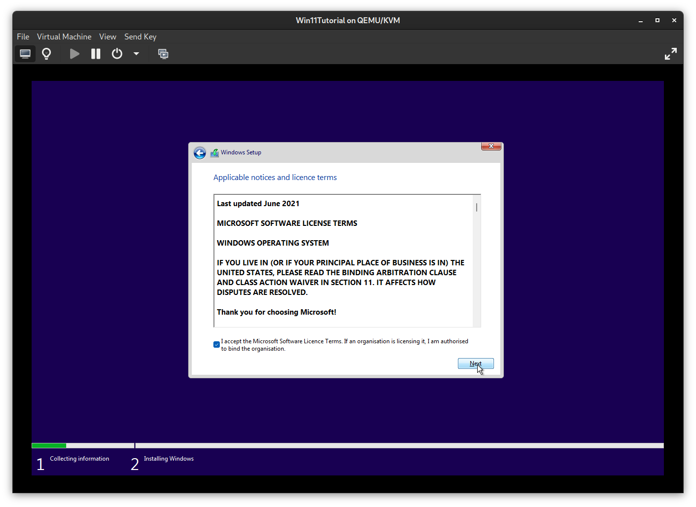
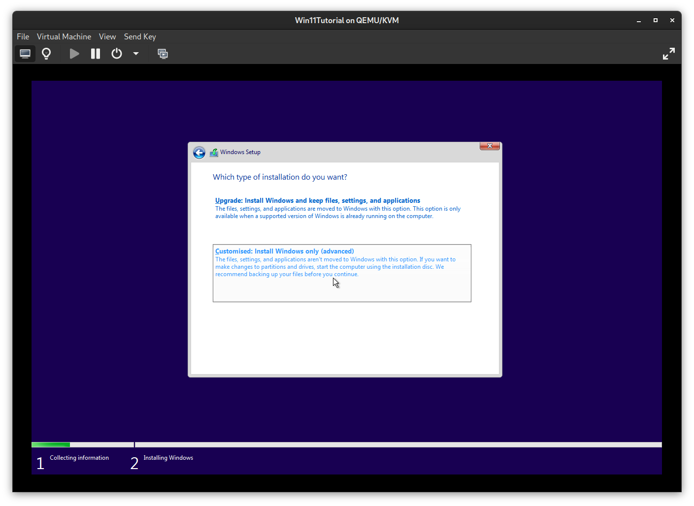
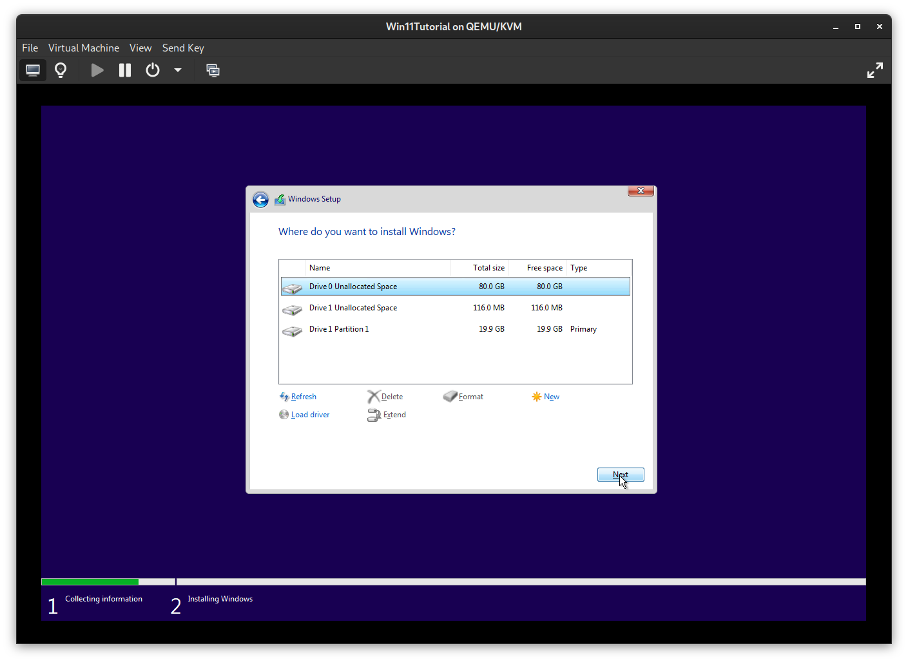
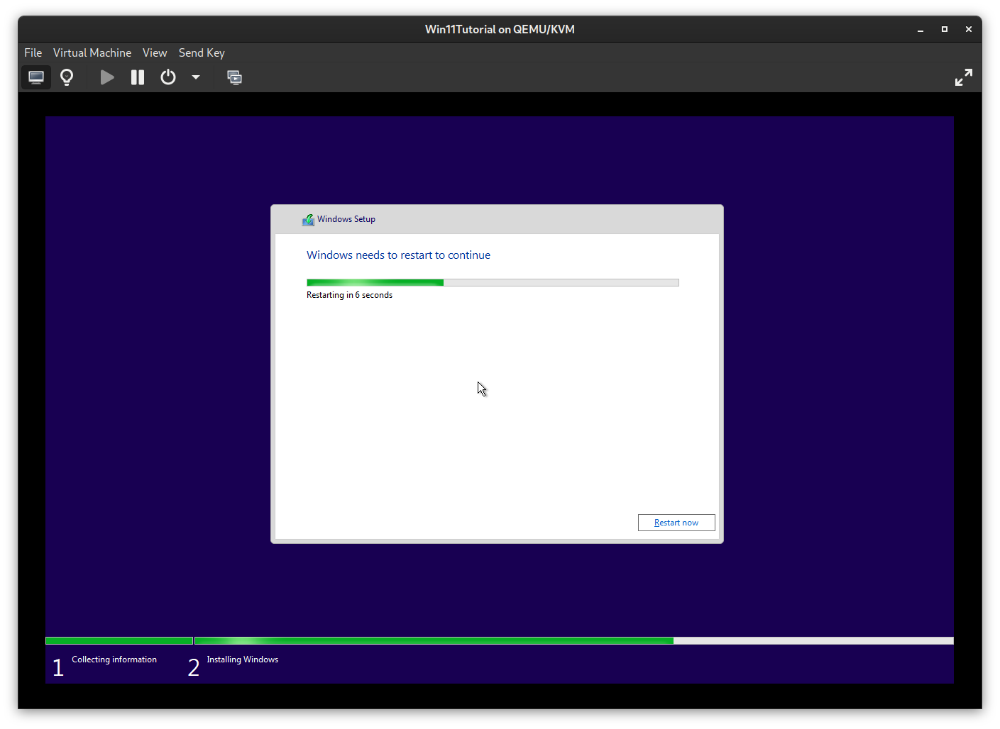
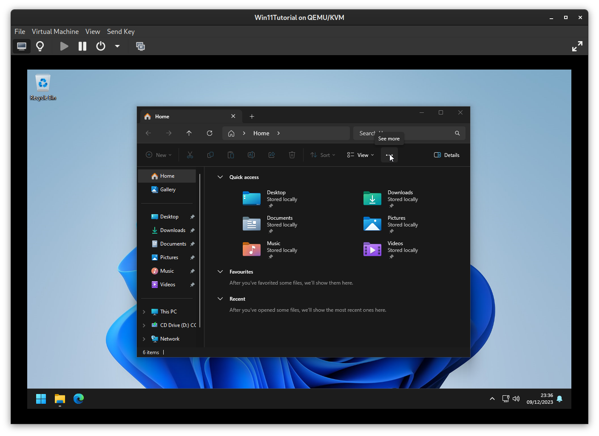

# Kirb's Optimal Windows 11 23H2 Guide
Current state: 10th December 2023

## Phase 1: Preparing your install
Make sure to back up all of your important data to an external/second drive, we are not responsible for any data loss or other issues that occur during or after following this guide.

- Download a Windows 11 ISO file from https://www.microsoft.com/en-us/software-download/windows11
- Get a 16GB+ USB-Stick and use the Windows 11 ISO to create a USB Installation Media, using a piece of Software like Rufus or Balena Etcher
- Plug in your newly flashed USB Installation Media and open the Boot Menu on your computer, typically available by spam-pressing F11 or F12 on your keyboard while your computer is booting. (The exact key to press depends on your Motherboard)
- Select your Windows 11 Installation Media
	- You may need to temporarily disable Secure Boot in your BIOS to boot from the USB-Stick, don't forget to re-enable Secure Boot after you've installed Windows 11.

## Phase 2: Installing Windows 11
- Select your Language, Time/Currency Format & Keyboard Layout and click on "Next"

- Click on "Install now"

- Click on "I don't have a product key" (We will come back to this later :3)

- Select "Windows 11 Pro" and click on "Next"

- Accept the Microsoft EULA and proceed

- Choose "Customized: Install Windows only (advanced)"

- Select the drive/partition you want to install Windows 11 to (Marked in blue)
	- If you see multiple partitions on the drive you want to install Windows to, you must select and delete each partition to use the entire drive for the new install
	- Make sure you're selecting the correct drive! When you proceed from this page, the selected drive or partition will be fully formatted and all data will be lost!
		- If you're unsure, physically disconnect every drive until you only have your USB-Stick and the drive you want to install windows to. Press "Refresh" after disconnecting a storage device
- Click on "Next" and wait for Windows to format and install to the selected drive, it will automatically restart to the setup.

## Phase 3: Setting up Windows 11
- !!! Disconnect your Computer from the Internet by unplugging your computer from ethernet and don't connect to a Wifi network during the setup phase !!!

- Select your Country/Region and proceed with "Yes"
- Select your Keyboard layout and proceed with "Yes"

- Add a second keyboard layout if you wish, in my case I'll "Skip" since I don't need it

- When Windows prompts you to connect to a network, click on "I don't have internet" and "Continue with limited setup", this will let us create a local account instead of being forced to tie our machine to a microsoft account
	- You can sign in to the Microsoft Store seperately later on if you need to access purchased software, the difference is that you will only be logged in on the Microsoft Store, not the entire OS

- Choose a hostname for your computer and proceed with "Next"
- Choose a username for your new local account and proceed with "Next"
	- If you have to select between a "Personal Account" and a "Work or Business account" and log in to an account, make sure you're disconnected from any wired and wireless networks, power off your machine and start again from Phase 3

- Enter and confirm your password

- You are now prompted to answer three "Security Questions" that can be used to reset your local accounts' password in case you forget it.
	- I heavily recommend not answering these 'Security Questions' truthfully, as it's not very hard for a third party to find this information, especially if you've already been victim to online data breaches or use social media. Instead, use totally bogus answers and note them down in a password manager or another kind of encrypted vault to keep them safe

### Phase 3.5: Giving Microsoft the middle finger
- After creating your local account, Windows now asks you for permission to collect all sorts of privacy-intrusive data. If you don't get the memo, say NO to ALL FOLLOWING PROMPTS just like in the following screenshots.
	- Note that this does not exactly disable 'all' telemetry, but we'll get back on that later!

## Phase 4: The Desktop
Congratulations, we're now on the desktop! Now you can happily unplug your USB-Stick with the Windows Installation Media, but we're far from done now!

- Delete the "Microsoft Edge" Icon from your desktop if you don't use edge, or if you just use the Taskbar to open it instead
- Unpin Microsoft Edge / Microsoft Store from the Taskbar if you don't use them

- Search and open 'Edit Group Policy' from the Start Menu / Windows Search
	- This will open the Group Policy Editor, if you don't know what you're doing, don't change anything outside of what this guide tells you to!

- Under "Computer Configuration", open "Administrative Templates" -> "Windows Components" -> "Data Collection and Preview Builds" and double-click on "Allow Diagnostic Data"

- In the "Allow Diagnostic Data" window, select "Disabled" and apply changes

- Now do the same thing, but this time under "User Configuration"
- Close the Group Policy Editor

- Reconnect your computer to the Network, plug in the Ethernet cable or connect your computer to a Wifi network
- Open the Terminal as administrator

- Enter the following command or copy it from https://github.com/massgravel/Microsoft-Activation-Scripts to open the "Microsoft Activation Script" by Massgravel

`irm https://massgrave.dev/get | iex`

- This should open a new window, click on it and select "[7] Extras" by pressing "7" on your Keyboard

- Select "[1] Change Windows Edition" by pressing "1" on your Keyboard
- Select "[6] Enterprise" by pressing "6" and "Enter" on your Keyboard
- Wait until it finishes and press "Enter" to return

- Restart your system

- Open the Terminal as administrator once again

- Press "Up" and "Enter" on your Keyboard to run to open the MAS Script again

- Select "[1] HWID | Windows | Permanent" by pressing "1" on your Keyboard
- Wait until it finishes and press "Enter" to return

- Close the Script and the Terminal

- Open the System Settings and...
- Go to "Personalization"
- "Colors"; To enable Dark Mode, select "Dark" under "Choose your mode". You can also change your accent color if you wish

- Go to "Windows Update"
- "Advanced Options"; Scroll down to "Delivery Optimization" and disable "Allow downloads from other PCs"

- Check for updates
- Get off your desk and take a break, let Windows Update do its thing (It'll take quite a while)

- When the updates are done, click on "Restart Now"
	- Note that you may need to repeat this cycle of updating and restarting a couple more times to be fully up to date, mileage may vary!

- Before proceeding any further, make sure to download and install all necessary Drivers from your Motherboard's Product page, as well as up to date graphics drivers from your GPU's manufacturer. If you have a laptop or a prebuilt computer, check the manufacturer's product page for your exact model

- Open the System Settings and...

- Go to "Privacy & Security"
- "General"; Disable every toggle

- "Inking & typing personalization"; Disable "Customised inking and typing dictionary"
	- Go to "Customized dictionary" and click on "Clear your customized dictionary"

- "Diagnostics & feedback"; Click on the "Delete" button under "Delete diagnostic data". Set the "Feedback frequency" to "Never"

- "Activity history"; Disable "Store my activity history on this device" and click on "Clear history"

- "Search permissions";
- Disable "Cloud content search" for Microsoft and Work/School accounts
- Disable and clear "Search history on this device".
- Disable "Show search highlights".
- Turn off SafeSearch at your own discretion if you're fine with potentially viewing adult content.

- Go to "System"
- "Display"; Configure your display settings with the correct Resolution, Refresh Rate, Display Order and Scale dependant on your setup. Optionally enable Night Light for comfortable viewing at night
	- Note that you may need to update your graphics drivers to use a higher resolution/refresh rate

- "Notifications"; Open the "Additional Settings" dropdown and disable the three checkboxes about Suggestions and Tips (They aren't very helpful)

- "Power"; Set your "Screen and sleep" settings to your liking, I prefer a shorter timeout time in case I forget to lock my screen.

- Go to "Bluetooth & Devices"
- "Devices"; Pair Bluetooth devices such as wireless mice, controllers or headphones

- "Mouse"; Adjust Mouse Settings to your liking, I recommend disabling "Enhanced pointer precision" under "Advanced Mouse Settings" -> "Pointer Options", especially so for gamers that want accurate aim

- Go to "Personalization"
- "Lock Screen"; I prefer switching from "Windows Spotlight" to a "picture" under "Personalise your lock screen"
- Disable "Get fun facts, tips, tricks and more on your lock screen"

- "Start"; Switch to the "More pins" layout and disabling "Show recently added apps" and "Show recommendations for tips, shortcuts, new apps, and more"

- "Taskbar"; I hide the Search, Task view and Widget buttons, but do what fits with your workflow!
	- Under "Taskbar behaviors"; You can set the "Taskbar alignment" for your app icons to be aligned to the center or to the left

- Go to "Accounts"
- "Your info"; Set a profile picture under "Adjust your photo"

 - "Sign-in options"; Enable alternative sign-in methods to your preference, for higher security don't rely on biometrics and use a hardware-key if possible

- Go to "Apps"
- "Installed Apps"; As you can see, there's a motherlode of bloatware that comes preinstalled with windows, we will now clean this machine up!

- I typically uninstall the following apps, as most of the time there are more viable and feature-rich alternatives out there, but this is your computer! So take this list with a grain of salt and keep the apps that you need for your workflow, this is simply how I would configure a new windows machine for myself:
		- "Clipchamp - Video Editor"
		- "Cortana"
		- "Feedback Hub"
		- "Films & TV"
		- "Mail and Calendar"
		- "Maps"
		- "Media Player"
		- "Microsoft News"
		- "Microsoft OneDrive"
		- "Microsoft To Do"
		- "Notepad"
		- "Office"
		- "Outlook (new)"
		- "Paint"
		- "People"
		- "Power Automate"
		- "Quick Assist"
		- "Solitaire Collection"
		- "Sticky Notes"
		- "Voice Recorder"

- Clean up your Start Menu, remove all of the ads by right-clicking and clicking on uninstall/unpin from start. Put programs that you need to have quick access to on the start menu later down the line

- Open the File Explorer
- Click on the "..." button at the top bar and go to "Options"

- Under "View", change the following settings:
	- Enable "Display the full path in the title bar"
	- Enable "Show hidden files, folders and drives"
	- Disable "Hide empty drives"
	- Disable "Hide extensions for known file types"
	- Enable "Launch folder windows in a seperate process"
	- Enable "Use check boxes to select items"
- Apply changes

- Open Microsoft Edge
	- Click "Don't allow" whenever possible, skip every prompt to log in to a microsoft account.
- Enter "winaerotweaker.com" on your search bar and download "Winaero Tweaker" on the website

- Open the "winaerotweaker.zip" file and run the setup.exe

- Install Winaero Tweaker, make sure to select the "Portable Mode" on the second page.

- Open the File Explorer and open "This PC" -> "C:" -> WinaeroTweaker -> "WinaeroTweaker.exe"

- Change the following tweaks inside Winaero Tweaker
	- Enable "Classic Full Context Menus" to restore the Windows 10 Right-Click context menus
	- Enable "Automatic Registry Backup"
	- Enable "Verbose Logon Messages"
	- Click on Restart Explorer
- Close Winaero Tweaker

- Right click the Taskbar
- Open the Task Manager
	- Open "Startup apps"
	- Disable Programs that you don't need to autostart every time, for example microsoft edge. Make sure to check this after you've installed your software.

Congratulations! You now have successfully installed Windows 11, removed most of the crap that comes preloaded on it, and made it more usable. The only thing left to do is for you to install your software and make this machine your own!
Roughly 100 Processes and 1.5 - 2GB of RAM Usage after a reboot.

## Phase 5: Recommended Software
This will be a list of software I recommend you to install on windows if needed. These are simply personal recommendations, you're free to use whatever software you prefer in the end:

- Dependencies: VCRedist++, .NET Framework

- Web Browser: Firefox
- E-Mail Client: Thunderbird
- Office Suite: Libreoffice, OnlyOffice
- Text Editor: Notepad++
- Anti-Virus: Windows Defender, Malwarebytes/virustotal.com for manual scans
- File Archiver: 7-Zip
- Storage Analyzer: Wiztree
- Gaming: Steam, Prism Launcher (Minecraft)
- Media Player: MPC-HC, VLC, mpv
- Drawing: Krita, Inkscape
- Photo Editing: Paint.NET (getpaint.net)
- Video Editing: Kdenlive, Davinci Resolve
- Video Recording: OBS
- Audio Editing: Audacity
- Torrenting: qBittorrent
- Hardware Info/Monitoring: Hwinfo64, CPU-Z, GPU-Z,
- GPU Overclocking/Fan Tuning: MSI Afterburner
